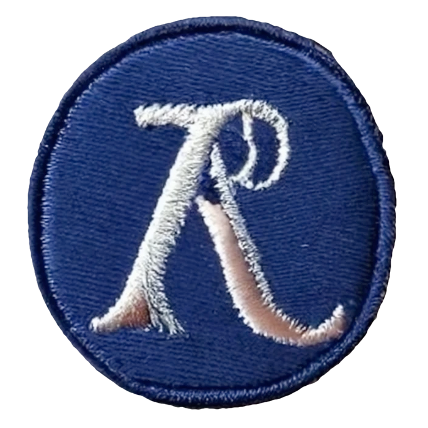

| | | | |
|---:|:---:|:---:|:---:|
| [**main**](https://github.com/pmonks/embroidery/tree/main) | [](https://github.com/pmonks/embroidery/actions?query=workflow%3ACI+branch%3Amain) | [](https://github.com/pmonks/embroidery/actions?query=workflow%3Adependencies+branch%3Amain) | [](https://pmonks.github.io/embroidery/nvd/dependency-check-report.html) |
| [**dev**](https://github.com/pmonks/embroidery/tree/dev)  | [](https://github.com/pmonks/embroidery/actions?query=workflow%3ACI+branch%3Adev) | [](https://github.com/pmonks/embroidery/actions?query=workflow%3Adependencies+branch%3Adev) | [](https://github.com/pmonks/embroidery/actions?query=workflow%3Avulnerabilities+branch%3Adev) |

[](https://clojars.org/com.github.pmonks/embroidery/) [](https://github.com/pmonks/embroidery/issues) [](https://github.com/pmonks/embroidery/blob/main/LICENSE)



# embroidery

A micro-library for Clojure that provides versions of `pmap` and `future` that have first class support for virtual threads on JVMs that support them, and which transparently falls back on Clojure core `pmap` and `future` when virtual threads are not supported.  These features are opt-in; this library does _not_ monkey patch core Clojure or mess with the thread pools etc. that it sets up.  It has no dependencies, other than on Clojure and any supported JVM, and is [less than 100 lines of code](https://github.com/pmonks/lice-comb/tree/main/src/embroidery).

## Installation

`embroidery` is available as a Maven artifact from [Clojars](https://clojars.org/com.github.pmonks/embroidery).

### Trying it Out

#### Clojure CLI

```shell
$ # Where #.#.# is replaced with an actual version number (see badge above)
$ clj -Sdeps '{:deps {com.github.pmonks/embroidery {:mvn/version "#.#.#"}}}'
```

#### Leiningen

```shell
$ lein try com.github.pmonks/embroidery
```

#### deps-try

```shell
$ deps-try com.github.pmonks/embroidery
```

## Usage

[API documentation is available here](https://pmonks.github.io/embroidery/), or [here on cljdoc](https://cljdoc.org/d/com.github.pmonks/embroidery/), and the [unit tests](https://github.com/pmonks/embroidery/blob/main/test/embroidery/api_test.clj) are also worth perusing to see worked examples.

## Contributor Information

[Contributing Guidelines](https://github.com/pmonks/embroidery/blob/main/.github/CONTRIBUTING.md)

[Bug Tracker](https://github.com/pmonks/embroidery/issues)

[Code of Conduct](https://github.com/pmonks/embroidery/blob/main/.github/CODE_OF_CONDUCT.md)

### Developer Workflow

This project uses the [git-flow branching strategy](https://nvie.com/posts/a-successful-git-branching-model/), with the caveat that the permanent branches are called `main` and `dev`, and any changes to the `main` branch are considered a release and auto-deployed (JARs to Clojars, API docs to GitHub Pages, etc.).

For this reason, **all development must occur either in branch `dev`, or (preferably) in temporary branches off of `dev`.**  All PRs from forked repos must also be submitted against `dev`; the `main` branch is **only** updated from `dev` via PRs created by the core development team.  All other changes submitted to `main` will be rejected.

### Build Tasks

`embroidery` uses [`tools.build`](https://clojure.org/guides/tools_build). You can get a list of available tasks by running:

```
clojure -A:deps -T:build help/doc
```

Of particular interest are:

* `clojure -T:build test` - run the unit tests
* `clojure -T:build lint` - run the linters (clj-kondo and eastwood)
* `clojure -T:build ci` - run the full CI suite (check for outdated dependencies, run the unit tests, run the linters)
* `clojure -T:build install` - build the JAR and install it locally (e.g. so you can test it with downstream code)

Please note that the `release` and `deploy` tasks are restricted to the core development team (and will not function if you run them yourself).

## License

Copyright © 2023 Peter Monks

Distributed under the [Apache License, Version 2.0](http://www.apache.org/licenses/LICENSE-2.0).

SPDX-License-Identifier: [Apache-2.0](https://spdx.org/licenses/Apache-2.0)
